<div align="center">


<h1>Data Lakehouse Blueprint</h1>

<p><strong>The Institutional-Grade Platform for Standardized Data Lakehouse Foundations, Medallion Governance, and Multi-Cloud Analytics Ecosystems.</strong></p>

[]()
[]()
[]()

<br/>

> **"Industrializing data analytics to automate lakehouse foundations."** 
> **Data Lakehouse Blueprint** is an enterprise-grade platform designed to provide a secure, measurable, and highly automated foundation for global lakehouse operations. It orchestrates the complex lifecycle of the medallion architecture—from automated ingestion and silver-layer cleansing to gold-layer serving and unified analytics auditing.

</div>

---

## 🏛️ Executive Summary

Fragmented data silos and manual analytics pipelines are strategic operational liabilities; lack of a standardized lakehouse blueprint is a primary barrier to organizational data maturity. Organizations fail to scale their analytics not because of a lack of tools, but because of fragmented data standards, lack of automated pipeline validation, and an inability to orchestrate analytics planes with operational precision.

This platform provides the **Analytics Intelligence Plane**. It implements a complete **Data-Lakehouse-Blueprint-as-Code Framework**, enabling Data Engineers and Analytics teams to manage global lakehouse foundations as first-class citizens. By automating the identification of data quality bottlenecks through real-time telemetry analysis and orchestrating the provisioning of secure performance-driven analytics policies, we ensure that every organizational data asset—from raw telemetry to executive gold tables—is processed by default, audited for history, and strictly aligned with institutional analytics frameworks.

---

## 📐 Architecture Storytelling: Principal Reference Models

### 1. Principal Architecture: Global Data Lakehouse & Analytics Intelligence Plane
This diagram illustrates the end-to-end flow from medallion telemetry ingestion and multi-cloud orchestration to gold-layer enforcement, performance validation, and institutional analytics auditing.

```mermaid
graph LR
    %% Subgraph Definitions
    subgraph MedallionIngress["Medallion & Pipeline Ingress"]
        direction TB
        Bronze["Bronze (Raw / Append-Only)"]
        Silver["Silver (Cleaned / De-duplicated)"]
        Gold["Gold (Business-Ready / Aggregated)"]
    end

    subgraph IntelligenceEngine["Analytics Intelligence Hub"]
        direction TB
        API["FastAPI Analytics Gateway"]
        PipelineOrchestrator["Global Medallion & Transformation Hub"]
        Governance_Hub["Compliance & Guardrail Hub"]
        AIOps_Validator["Drift & Quality Analysis Hub"]
    end

    subgraph OperationsPlane["Distributed Analytics Ecosystem"]
        direction TB
        ManagedLakehouses["Managed Standardized Lakehouses"]
        ActivePipelines["Managed Automated ML Pipelines"]
        ServingSinks["Managed Infrastructure Delivery Hubs"]
    end

    subgraph OperationsHub["Institutional Data Hub"]
        direction TB
        Scorecard["Analytics Maturity Scorecard"]
        Analytics["Analytics Flow & Quality Velocity Stats"]
        Audit["Forensic Analytics Metadata Lake"]
    end

    subgraph DevOps["Data-Lakehouse-Blueprint-as-Code Framework"]
        direction TB
        TF["Terraform Analytics Modules"]
        DriftBot["Productivity & Config Drift Validator"]
        ChatOps["Measurement Operations Hub"]
    end

    %% Flow Arrows
    MedallionIngress -->|1. Submit Telemetry| API
    API -->|2. Orchestrate Analytics| PipelineOrchestrator
    PipelineOrchestrator -->|3. Apply Privacy Guard| Governance_Hub
    Governance_Hub -->|4. Assess Drift| AIOps_Validator
    
    AIOps_Validator -->|5. Execute Transformation| OperationsPlane
    OperationsPlane -->|6. Notify Status| ChatOps
    API -->|7. Visualize Health| Scorecard
    
    Scorecard -->|8. Track Maturity| Analytics
    Scorecard -->|9. Record Performance| Audit
    
    TF -->|10. Provision Backbone| IntelligenceEngine
    DriftBot -->|11. Inject Friction Risk| PipelineOrchestrator
    Audit -->|12. Improve Operations| ManagedLakehouses

    %% Styling
    classDef ingress fill:#f5f5f5,stroke:#616161,stroke-width:2px;
    classDef intel fill:#e8eaf6,stroke:#1a237e,stroke-width:2px;
    classDef operations fill:#e1f5fe,stroke:#01579b,stroke-width:2px;
    classDef ops fill:#ede7f6,stroke:#311b92,stroke-width:2px;
    classDef devops fill:#e8f5e9,stroke:#1b5e20,stroke-width:2px;

    class MedallionIngress ingress;
    class IntelligenceEngine intel;
    class OperationsPlane operations;
    class OperationsHub ops;
    class DevOps devops;
```

### 2. The Lakehouse Lifecycle Flow
The continuous path of a data lakehouse platform from initial integration (bronze) and aggregation (silver) to active analysis (gold), optimization (serving), and institutional forensic auditing (scorecard).

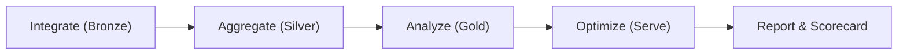

### 3. Distributed Lakehouse Topology
Strategically orchestrating standardized lakehouses across global data regions, diverse cloud architectures, and multi-cloud targets, providing a unified institutional view of global analytics health and operational readiness.

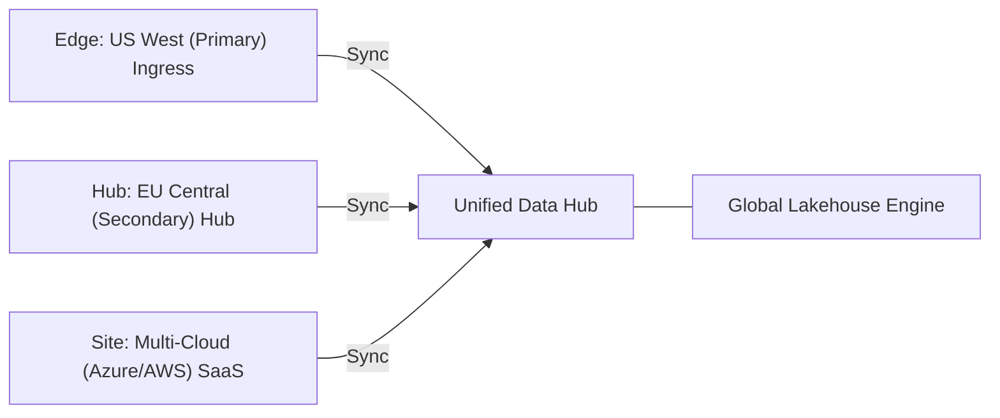

### 4. Lakehouse Governance & High-Trust Data Plane Protection Flow
Executing complex logic for securing the bridge between data analysts and production lakehouses, ensuring every organizational identity is verified, data-at-rest is encrypted, and every analytics access is according to institutional standards.

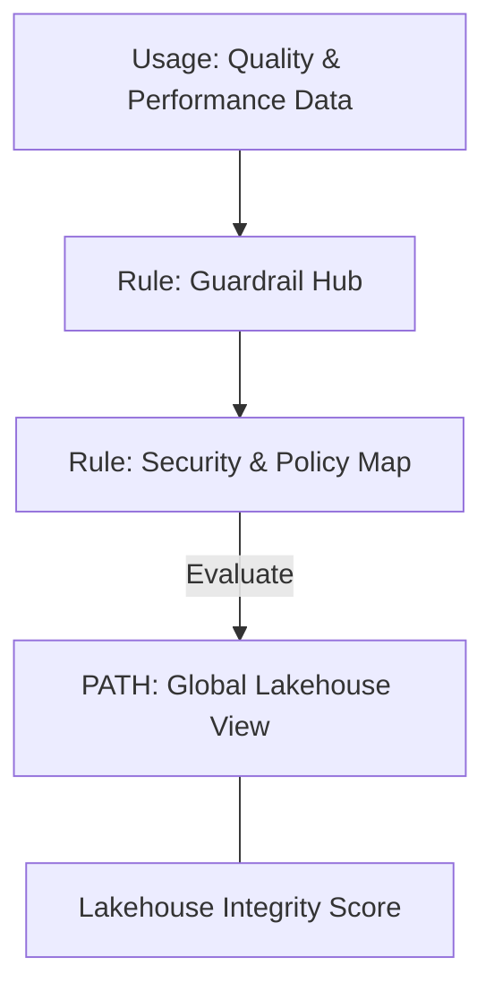

### 5. Multi-Cloud Lakehouse Federation & Governance Flow
Automatically managing unified lakehouse standards across global regions and diverse cloud tenants, ensuring institutional data residency and privacy boundaries by default.

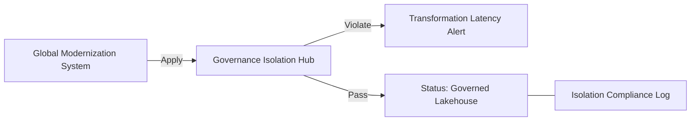

### 6. Encryption & Perimeter Protection Flow (Lakehouse Standard)
Managing the lifecycle of an analytics request, automatically enforcing institutional TLS 1.3 and resource encryption standards as required by security policy, ensuring zero-latency security confidence.

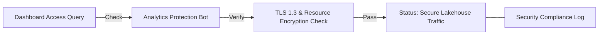

### 7. Institutional Lakehouse Maturity Scorecard
Grading organizational performance based on key indicators: Pipeline Freshness Index, Data Quality Index, and Analytics Adoption Scores.

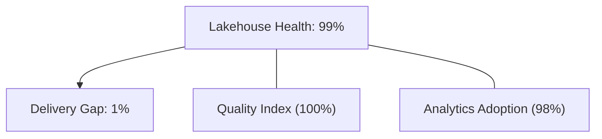

### 8. Identity & RBAC for Lakehouse Governance
Managing fine-grained access to lakehouse hubs, provisioning workers, and audit logs between CDOs, Data Engineering Managers, and SREs.

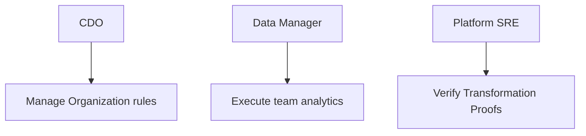

### 9. IaC Deployment: Data-Lakehouse-Blueprint-as-Code Framework
Using modular Terraform to deploy and manage the versioned distribution of the lakehouse tracking hubs, transformation protection workers, and forensic metadata lakes.

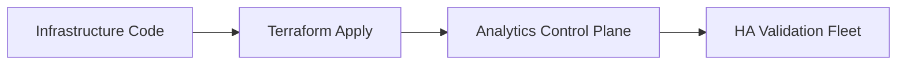

### 10. AIOps Lakehouse Drift & Risk Validation Flow
Using advanced analytics to identify sudden surges in transformation latency, unauthorized medallion changes, suspicious configuration drifts, or unusual delivery pattern changes that could result in institutional risk or data corruption.

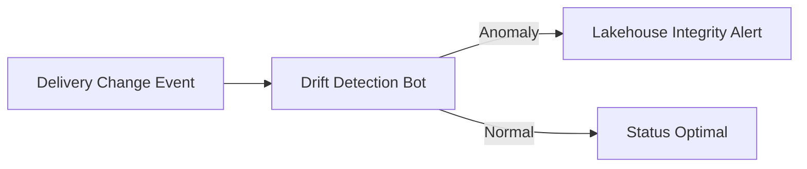

### 11. Metadata Lake for Forensic Lakehouse Audit
Storing long-term records of every medallion integration event (metadata), every transformation executed, and every version history for institutional record-keeping, compliance auditing, and post-provisioning forensics.

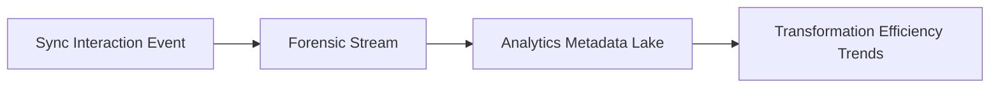

---

## 🏛️ Core Governance Pillars

1.  **Unified Foundation Coordination**: Maximizing resilience by centralizing all analytics measurement through a single institutional plane.
2.  **Automated Lakehouse Provisioning**: Eliminating "manual pipeline" scenarios through proactive orchestration and pattern verification.
3.  **Sequential Medallion Intelligence**: Ensuring zero-interruption operations through dependency-aware medallion-driven data engineering.
4.  **Zero-Trust Identity Protection**: Automatically enforcing identity-based access, data-at-rest encryption, and policy evaluation across all analytics tiers.
5.  **Autonomous Operations Logic**: Guaranteeing reliability through automated industry-specific effectiveness monitoring runbooks.
6.  **Full Analytics Auditability**: Immutable recording of every transformation change and analytics provision for institutional forensics.

---

## 🛠️ Technical Stack & Implementation

### Analytics Engine & APIs
*   **Framework**: Python 3.11+ / FastAPI.
*   **Performance Engine**: Custom Python-based logic for multi-toolchain ingestion and medallion metrics.
*   **Integrations**: Native connectors for Databricks, Snowflake, Fabric, and dbt Cloud.
*   **Persistence**: PostgreSQL (Analytics Ledger) and Redis (Live Transformation State).
*   **Auth Orchestrator**: Federated OIDC/SAML for least-privilege analytics management access.

### Governance Dashboard (UI)
*   **Framework**: React 18 / Vite.
*   **Theme**: Dark, Slate, Indigo (Modern high-fidelity productivity aesthetic).
*   **Visualization**: D3.js for delivery topologies and Recharts for readiness velocity analytics.

### Infrastructure & DevOps
*   **Runtime**: AWS EKS or Azure Kubernetes Service (AKS) for management plane.
*   **Measurement Hub**: Managed event sourcing for immutable productivity timeline reconstruction.
*   **IaC**: Modular Terraform for deploying the analytics landing zone and validation fleet.

---

## 🏗️ IaC Mapping (Module Structure)

| Module | Purpose | Real Services |
| :--- | :--- | :--- |
| **`infrastructure/analytics_hub`** | Central management plane | EKS, PostgreSQL, Redis |
| **`infrastructure/enforcers`** | Distributed lakehouse provisioners | Azure, AWS, GCP APIs |
| **`infrastructure/transformation_pipes`** | Data Ingestion Hubs | Webhooks, Lambda |
| **`infrastructure/auditing`** | Forensic modernization sinks | S3, Athena, Quicksight |

---

## 🚀 Deployment Guide

### Local Principal Environment
```bash
# Clone the Data Lakehouse Blueprint repository
git clone https://github.com/devopstrio/data-lakehouse-blueprint.git
cd data-lakehouse-blueprint

# Configure environment
cp .env.example .env

# Launch the Analytics stack
make init

# Trigger a mock lakehouse update and automated guardrail validation simulation
make simulate-lakehouse
```

Access the Management Portal at `http://localhost:3000`.

---

## 📜 License
Distributed under the MIT License. See `LICENSE` for more information.

---
<div align="center">
  <p>© 2026 Devopstrio. All rights reserved.</p>
</div>
