<div align="center">


<h1>Data Lakehouse Blueprint</h1>

<p><strong>The Strategic Architecture Hub for Unified Analytics, Medallion Governance, and Industrial-Scale Data Excellence</strong></p>

[]()
[]()
[]()
[]()

<br/>

> **"Unifying the speed of a warehouse with the scale of a lake."** 
> Data Lakehouse Blueprint is a premium reference platform designed to provide production-ready blueprints for building a modern data lakehouse across Azure, AWS, and GCP.

</div>

---

## 🏛️ Executive Summary

**Data Lakehouse Blueprint** is a flagship reference platform designed for Chief Data Officers (CDOs), Platform Engineers, and Data Architects. In an era where data silos and fragmented analytics engines cripple innovation, the **Lakehouse** architecture offers a unified path forward.

This platform provides a complete **Data Operating Model**, demonstrating how to orchestrate the **Medallion Architecture (Bronze, Silver, Gold)** using **Databricks**, **Snowflake**, **Microsoft Fabric**, and open-source engines like **Trino** and **Spark**. It delivers ready-to-use **Infrastructure as Code (Terraform)**, **dbt-driven transformations**, and high-fidelity dashboards for monitoring pipeline health, data quality, and platform costs.

---

## 💡 Why Lakehouse Matters

The traditional separation between Data Lakes (for AI/ML) and Data Warehouses (for BI) is no longer sustainable.
- **Unified Governance**: Applying a single security and lineage model across all data assets.
- **Cost Efficiency**: Eliminating the "Data Tax" of moving data between lakes and warehouses.
- **Concurrency & Performance**: Supporting high-concurrency BI queries directly on object storage using Delta Lake, Iceberg, or Hudi.
- **AI / ML Readiness**: Providing clean, governed data directly to data science sandboxes without ETL delays.

---

## 🚀 Business Outcomes

### 🎯 Strategic Data Impact
- **70% Faster Time-to-Insight**: Reducing the data engineering bottleneck through standardized medallion patterns.
- **Zero-Trust Data Governance**: Verifiable lineage and PII masking from ingestion to consumption.
- **Cost-Optimized Scale**: Leveraging tiered storage and ephemeral compute to scale analytics without linear cost growth.
- **Industrialized ML**: Creating a seamless bridge between raw data lakes and high-performance feature stores.

---

## 🏗️ Technical Stack

| Layer | Technology | Rationale |
|---|---|---|
| **Data Engines** | Spark, dbt, Trino | Industry-standard distributed processing and transformation. |
| **Storage** | Delta Lake, Iceberg | Providing ACID transactions and schema enforcement on object storage. |
| **Orchestration** | Airflow / GHA | Managing complex multi-cloud pipeline dependencies. |
| **Backend** | FastAPI | High-performance API for metadata and control plane operations. |
| **Frontend** | React 18, Vite | Premium portal for data product catalogs and pipeline visibility. |
| **Infrastructure** | Terraform | Multi-cloud IaC for consistent platform replication. |

---

## 📐 Architecture Storytelling: 55+ Diagrams

### 1. Executive High-Level Architecture
The holistic vision of the enterprise lakehouse ecosystem.

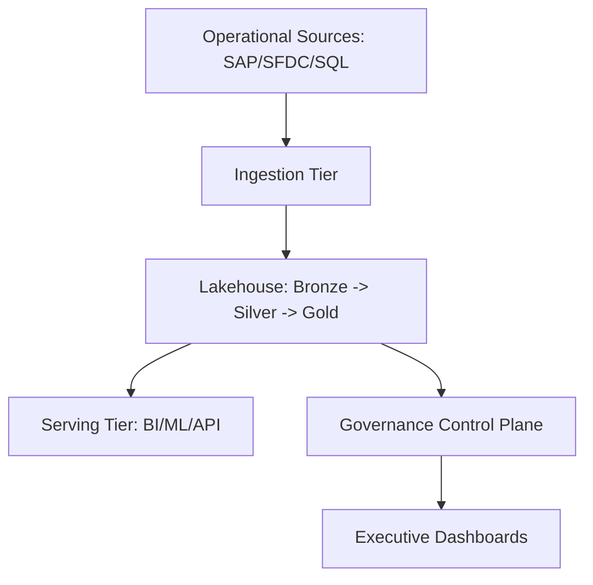

### 2. Detailed Component Topology
The internal service boundaries and secure data movement paths.

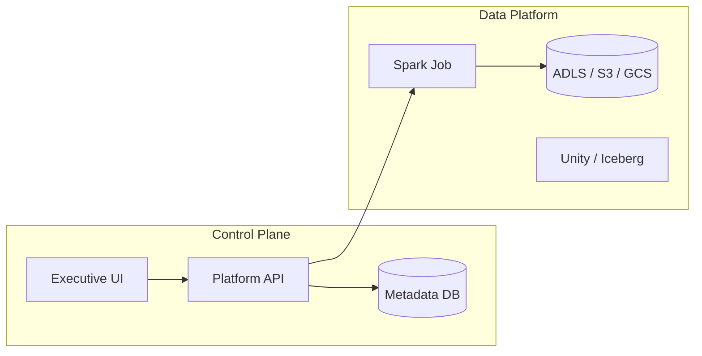

### 3. Frontend to Backend Request Path
Tracing a request to view "Pipeline Health" through the platform.

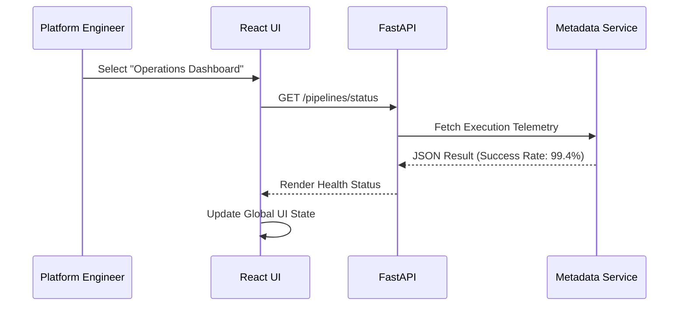

### 4. Lakehouse Control Plane
Orchestrating state and connectivity across diverse data engines.

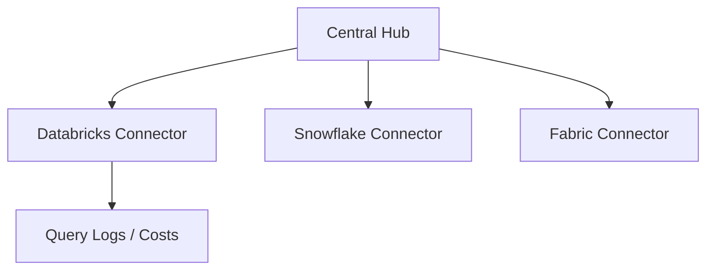

### 5. Multi-Cloud Data Platform Topology
The global footprint of an enterprise lakehouse.

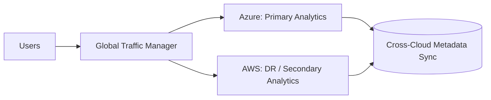

### 6. Regional Deployment Model
Standardizing the data stack within each cloud region.

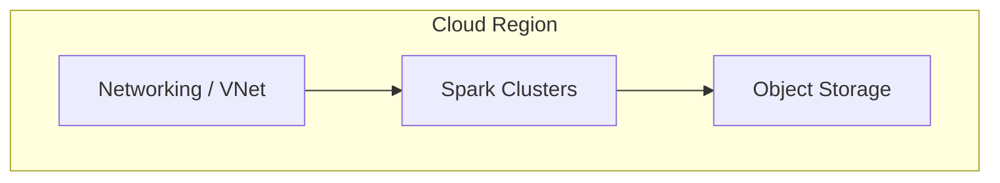

### 7. DR Failover Model
Continuous analytics availability during provider outages.

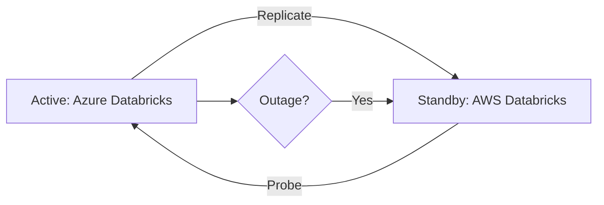

### 8. API Gateway Architecture
Securing the entry point for data platform orchestration.

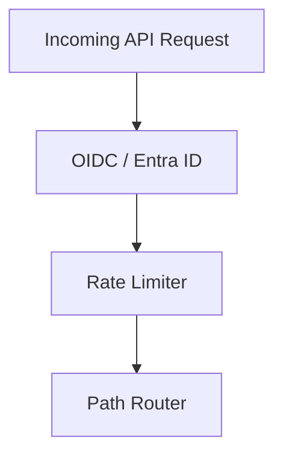

### 9. Queue Worker Architecture
Managing background metadata sync and report generation.

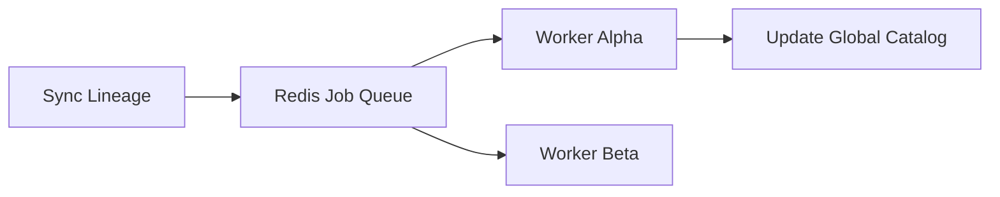

### 10. Dashboard Analytics Flow
How raw telemetry becomes executive platform scorecards.

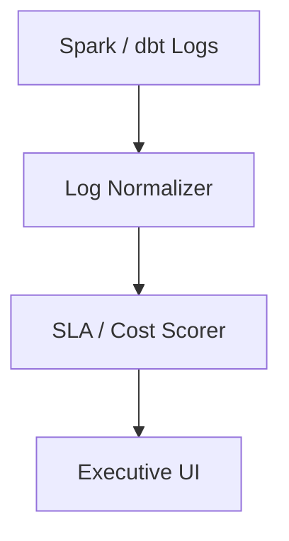

### 11. Bronze Ingestion Workflow
Raw data landing zone with minimal transformation.

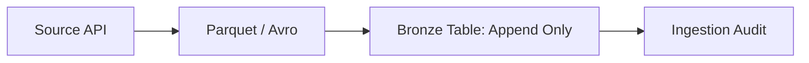

### 12. Silver Transformation Flow
Filtered, cleaned, and augmented data layer.

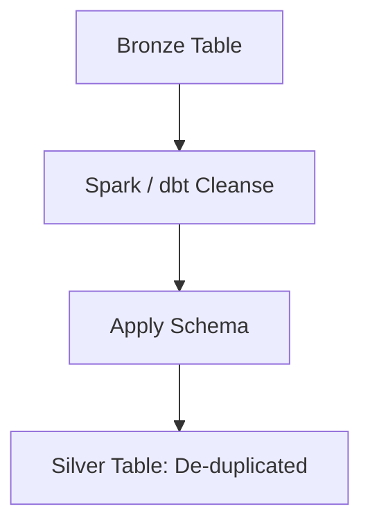

### 13. Gold Serving Model
Aggregated, business-ready data for BI and analytics.

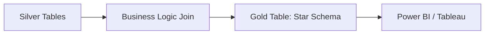

### 14. CDC Ingestion Lifecycle
Real-time capture of changes from operational databases.

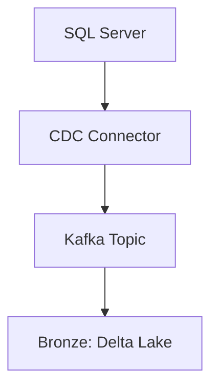

### 15. Batch Scheduler Workflow
Orchestrating daily/hourly batch processing.

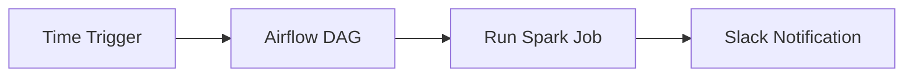

### 16. Streaming Kafka Pipeline
Low-latency data processing for real-time insights.

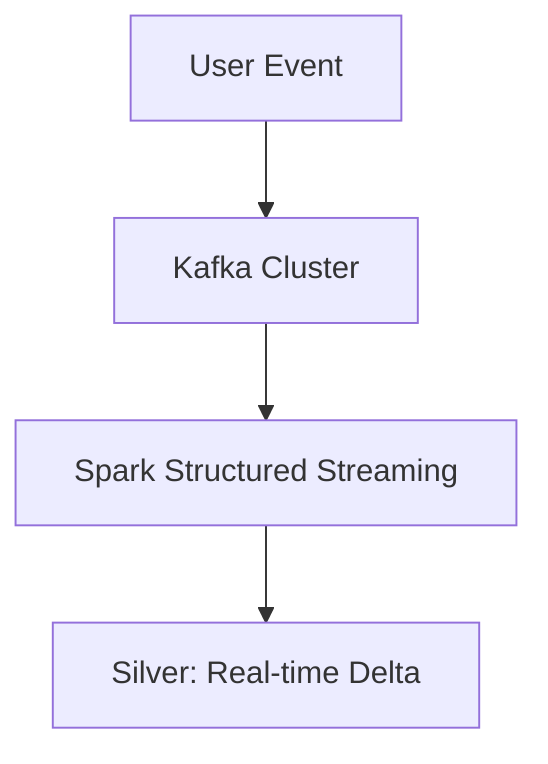

### 17. File Drop Ingestion Flow
Automated processing of files landed in object storage.

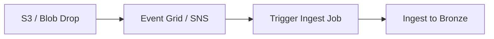

### 18. Data Quality Validation Flow
Applying DQ gates between medallion layers.

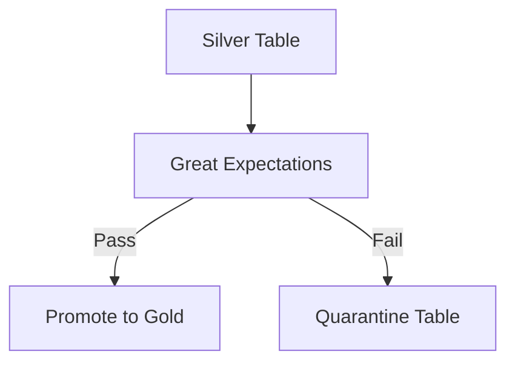

### 19. Schema Evolution Workflow
Managing changes to data structures without breaking pipelines.

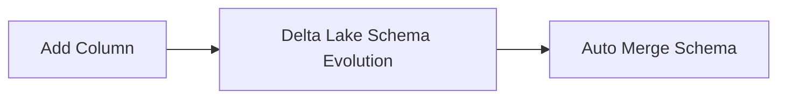

### 20. Late Arriving Data Model
Handling data that arrives outside of its expected window.

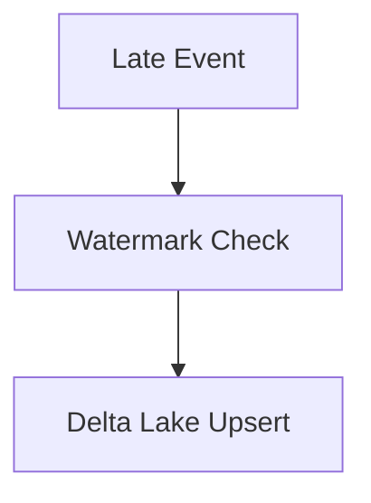

### 21. Semantic Model Architecture
Abstracting complex joins for BI users.

```mermaid
graph LR
    Gold[Gold Tables] --> Cube[Semantic Layer: Metric Store]
    Cube --> User[Business User]
```

### 22. Power BI Integration Flow
High-performance direct query or import models.

```mermaid
graph TD
    PBI[Power BI] --> Gateway[DirectQuery Gateway]
    Gateway --> Trino[Trino / Databricks SQL]
```

### 23. Tableau Integration Flow
Enterprise BI connectivity to the lakehouse.

```mermaid
graph LR
    Tab[Tableau] --> JDBC[JDBC / ODBC]
    JDBC --> Snowflake[Snowflake Horizon]
```

### 24. Self-Service Analytics Model
Empowering analysts to build their own datasets.

```mermaid
graph TD
    Catalog[Data Catalog] --> Sandbox[Analytics Sandbox]
    Sandbox --> Explore[SQL Discovery]
```

### 25. Executive KPI Dashboard Flow
Feeding board-level metrics from the gold layer.

```mermaid
graph LR
    Metrics[Revenue / Cost] --> Agg[Aggregator Job]
    Agg --> Dash[Executive Dashboard]
```

### 26. Row-Level Security Model
Enforcing data privacy at the query level.

```mermaid
graph TD
    Query[User Query] --> Policy[Check User Role]
    Policy --> Filter[Apply Filter: Region='EU']
```

### 27. Metric Layer Workflow
Unified definitions for core business metrics.

```mermaid
graph LR
    dbt[dbt Semantic Layer] --> Metric[Calculate ARR]
    Metric --> All_Apps[Consistent in All Apps]
```

### 28. Cached Query Acceleration Model
Reducing latency for frequent dashboard queries.

```mermaid
graph TD
    Query[User Query] --> Cache[Redis / Result Cache]
    Cache -->|Miss| Engine[Query Engine]
```

### 29. Federated Query Model
Querying data across multiple clouds/engines.

```mermaid
graph LR
    Trino[Trino] --> AWS[S3 Data]
    Trino --> Azure[Blob Data]
```

### 30. Data Product Consumption Flow
The "Data as a Product" lifecycle.

```mermaid
graph TD
    Owner[Domain Owner] --> Publish[Register Product]
    Publish --> Consumer[App / BI User]
```

### 31. Feature Engineering Workflow
Transforming raw data into ML-ready features.

```mermaid
graph LR
    Gold[Gold Data] --> Transform[Spark ML Transform]
    Transform --> Feature[Feature Set]
```

### 32. Feature Store Model
Centralized management of reusable ML features.

```mermaid
graph TD
    Store[Feature Store] --> Offline[Batch Training]
    Store --> Online[Real-time Serving]
```

### 33. Model Training Data Flow
Building the foundation for AI models.

```mermaid
graph LR
    Query[Snapshot Query] --> Train[Training Set]
    Train --> MLFlow[MLFlow Tracking]
```

### 34. Real-time Scoring Pipeline
Serving model predictions in sub-second latency.

```mermaid
graph TD
    Request[User Request] --> Model[Deployed Model]
    Model --> Score[Prediction Result]
```

### 35. GenAI Retrieval Data Flow
Vectorized data for RAG (Retrieval Augmented Generation).

```mermaid
graph LR
    Docs[Documents] --> Embed[Embedding Model]
    Embed --> VectorDB[Vector Database]
```

### 36. Vector Indexing Lifecycle
Maintaining the searchability of unstructured data.

```mermaid
graph TD
    New[New Doc] --> Chunk[Text Chunking]
    Chunk --> Index[Update Vector Index]
```

### 37. Experiment Tracking Model
Managing the lifecycle of ML experiments.

```mermaid
graph LR
    Params[Hyperparams] --> MLFlow[MLFlow]
    MLFlow --> Metrics[Accuracy / Loss]
```

### 38. Notebook Collaboration Flow
Data science team workflow.

```mermaid
graph TD
    Dev[Write Code] --> Git[Commit to Repo]
    Git --> PR[Peer Review]
```

### 39. Data Science Sandbox Model
Isolated environments for experimentation.

```mermaid
graph LR
    Admin[Admin] --> Grant[Temp Access]
    Grant --> Sandbox[Isolated Bucket]
```

### 40. ML Governance Workflow
Auditing model bias and performance.

```mermaid
graph TD
    Monitor[Drift Monitor] --> Alert[Model Drift Detected]
    Alert --> Retrain[Trigger Retraining]
```

### 41. Data Lineage Workflow
Visualizing the end-to-end data journey.

```mermaid
graph LR
    Source[Source] --> Bronze[Bronze]
    Bronze --> Silver[Silver]
    Silver --> Gold[Gold]
```

### 42. Catalog Integration Flow
Synchronizing lakehouse state with enterprise catalogs.

```mermaid
graph TD
    Schema[Table Schema] --> Purview[Azure Purview]
    Purview --> Search[Metadata Search]
```

### 43. Classification Lifecycle
Identifying sensitive data within the lakehouse.

```mermaid
graph LR
    Scan[PII Scan] --> Tag[Apply Sensitivity Tag]
```

### 44. PII Masking Model
Protecting sensitive data for non-privileged users.

```mermaid
graph TD
    Request[User Request] --> Policy[Apply Masking]
    Policy --> Result[Email: j***@example.com]
```

### 45. Key Management Workflow
Encrypting data at rest across clouds.

```mermaid
graph LR
    Vault[Key Vault] --> KMS[AWS KMS]
    KMS --> Encrypt[Storage Encryption]
```

### 46. OIDC / SSO Auth Flow
Securing the lakehouse control plane.

```mermaid
sequenceDiagram
    User->>Portal: Login
    Portal->>AzureAD: Auth
    AzureAD-->>User: Token
```

### 47. RBAC / ABAC Model
Granular access control for data assets.

```mermaid
graph TD
    Role[Data Scientist] --> Grant[Access to Silver/Gold]
```

### 48. Audit Logging Architecture
Recording every data access and modification.

```mermaid
graph LR
    Action[Query Table] --> Log[Immutable Audit Store]
```

### 49. Retention Lifecycle
Enforcing data deletion policies.

```mermaid
graph TD
    Policy[Retention Rule] --> Age[Calculate Data Age]
    Age --> Purge[Wipe Old Data]
```

### 50. Access Request Workflow
Governing how users gain access to data products.

```mermaid
graph LR
    Req[Access Request] --> App[Owner Approval]
    App --> Prov[Auto-Provisioning]
```

### 51. Metrics Pipeline
Monitoring platform health and performance.

```mermaid
graph LR
    Logs[System Logs] --> Prom[Prometheus]
    Prom --> Grafana[Operational Board]
```

### 52. Logging Architecture
Centralized logs for cross-cloud pipelines.

```mermaid
graph TD
    Azure[Azure Logs] --> Splunk[Splunk Cloud]
    AWS[AWS Logs] --> Splunk
```

### 53. Tracing Model
Distributed tracing for complex pipeline steps.

```mermaid
sequenceDiagram
    Pipeline->>Step1: Ingest
    Step1->>Step2: Validate
```

### 54. SLA Monitoring Flow
Guaranteeing data freshness for the business.

```mermaid
graph LR
    Fresh[Data Freshness] --> Alert[SLA Breach Alert]
```

### 55. Release Pipeline Workflow
Continuous delivery of lakehouse code.

```mermaid
graph LR
    Git[Code Push] --> GHA[GitHub Actions]
    GHA --> Prod[Deploy to Production]
```

---

## 🔬 Lakehouse Modernization Guidance

### 1. The Medallion Architecture
We advocate for the **Medallion Architecture** to ensure data quality and trust at scale.
- **Bronze**: Raw data in its native format. Immutable and append-only.
- **Silver**: Cleaned, filtered, and joined data. The source of truth for downstream analysts.
- **Gold**: Business-level aggregates and star schemas, optimized for BI consumption.

### 2. Cost Optimization framework
Managing lakehouse costs requires a tiered strategy:
- **Tier 1: Compute Efficiency**: Using ephemeral clusters and autoscaling to minimize idle time.
- **Tier 2: Storage lifecycle**: Moving cold data to archive storage tiers.
- **Tier 3: Query Optimization**: Leveraging materialized views and Z-Order indexing for frequent queries.

---

## 🚦 Getting Started

### 1. Prerequisites
- **Terraform** (v1.5+).
- **Docker Desktop**.
- **Azure & AWS CLI** configured.

### 2. Local Setup
```bash
# Clone the repository
git clone https://github.com/Devopstrio/data-lakehouse-blueprint.git
cd data-lakehouse-blueprint

# Start the Lakehouse Control Plane
docker-compose up --build
```
Access the Platform Portal at `http://localhost:3000`.

---

## 🛡️ Governance & Security
- **Immutable Audit Logs**: Every pipeline execution and data access is recorded in an immutable storage bucket.
- **Identity First**: Native integration with **Microsoft Entra ID** and **AWS IAM** for seamless cross-cloud auth.
- **Data Product Certification**: Automated quality gates ensure that only "Certified" datasets reach the Gold layer.

---
<sub>&copy; 2026 Devopstrio &mdash; Engineering the Future of Global Analytics.</sub>
